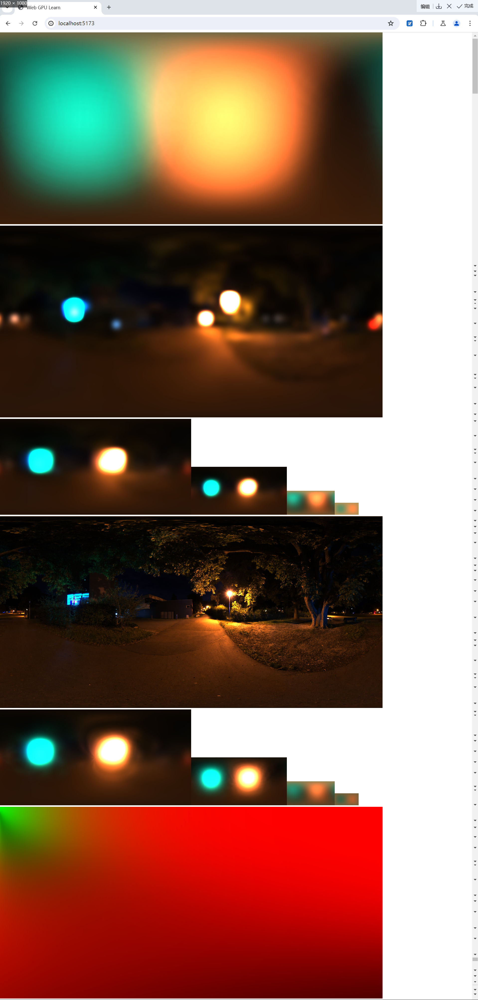

# 学习和案例
https://webgpufundamentals.org/webgpu/lessons/webgpu-fundamentals.html 

https://webgpu.github.io/webgpu-samples/

https://jinleili.github.io/learn-wgpu-zh/simuverse

# 加载模型

https://carmencincotti.com/2022-06-06/load-obj-files-into-webgpu/

https://www.willusher.io/archive 

https://toji.dev/webgpu-gltf-case-study/

# WGSL语言介绍

- <a href="https://zhuanlan.zhihu.com/p/645215443">WGSL语言介绍</a>
- <a href="https://google.github.io/tour-of-wgsl/">tour-of-wgsl</a>
- <a href="https://www.w3.org/TR/WGSL/">w3c-wgsl</a>

# 主要封装 (Updating，最新的内容还未更新)

主要封装的工具都在 <a href="./src/tools/">tools</a> 目录下，其中核心封装有（其他库没有的）

- `tools/camera` 实现了 `PerspectiveCamera` 和 `OrbitController` 类来设置相机及其控制器，可以使用鼠标操作来控制相机视角。Controls: left-click to drag, right-click to pan, scroll to zoom.
- `tools/loaders` 实现了 `ObjLoader` 和 `GLTFLoaderV2` 分别来加载 `obj` 和 `gltf` 模型
- `tools/scene` 实现了场景管理，可以添加相加，灯光，模型，控制器等
- `tools/renderer` 实现了 WebGPU 渲染器，负责渲染场景
- `tools/lights` 实现了平行光和点光源
- `tools/utils.ts` 实现了 `StaticTextureUtils` 来创建一些特殊的贴图 `createDepthTexture` 和 `createMultiSampleTexture`
- `tools/math.ts` 实现一些常用的数学函数
- `tools/index.ts` 实现了 `checkWebGPUSupported` 和 `createCanvas` 来初始化 GPUDevice 和 canvas

使用案例见 <a href="./src/examples/14-加载gltf模型/index.ts">14-加载gltf模型</a>，我们已经做了一些必要的优化，例如缓存以减少重复创建管线和资源、更改 `render-order` 来减少管线的切换和重复的资源绑定，具体优化手段见 <a href="https://qwuzvjx4mo.feishu.cn/docx/DO7zdbtozoyp9mxyeLuc6GoDnnb">>>></a>，最终 GLTF 的渲染流程和如下代码一致


## GLTF 模型加载用法

```typescript
import { checkWebGPUSupported, createCanvas } from "../../tools";
import { degToRad } from "../../tools/math";
import { StaticTextureUtils } from "../../tools/utils";
import { GLTFLoaderV2 } from "../../tools/loaders/GLTFLoader-v2";
import { OrbitController, PerspectiveCamera } from "../../tools/camera";
import { ObjLoader } from "../../tools/loaders/ObjLoader";
import { GUI } from "dat.gui";
import { Scene } from "../../tools/scene";
import { DirectionLight } from "../../tools/lights";
import { WebGPURenderer } from "../../tools/renderer";

const base = location.href;

// 配置
const config = {
  path: `${base}glTF-Sample-Models/2.0/Sponza/glTF-Binary/Sponza.glb`,
  near: 0.01,
  far: 100,
  eye: [5, 10, 0],
  target: [0, 3, 0],
  zoomSpeed: 10,
},

// 新建一个 WebGPURenderer
const renderer = await new WebGPURenderer().checkSupport();

// 创建场景对象
const scene = new Scene(renderer.device);

// 创建灯光
const light = new DirectionLight([-1, -1, -1], [1, 1, 1, 1], 10);
scene.add(light);

// 创建相机和控制器
const camera = new PerspectiveCamera(
  degToRad(75),
  renderer.aspect,
  config.near,
  config.far
);
camera.lookAt(config.eye, config.target);
const orbitController = new OrbitController(camera, renderer.canvas, {
  zoomSpeed: config.zoomSpeed,
});
scene.add(orbitController);

// 加载 gltf 模型 或者 obj 模型
const loader = model_name === "bunny" ? new ObjLoader() : new GLTFLoaderV2();
const model = await loader.load(renderer.device, config.path, {
  bindGroupLayouts: [scene.bindGroupLayout],
  format: renderer.format,
});
scene.add(model);

// 循环运行渲染
async function frame() {
  renderer.render(scene);
  requestAnimationFrame(frame);
}
```

### 加载效果截图

项目地址：https://yanglebupt.github.io/webgpu-engine/ 由于默认加载线上模型，请求模型并下载需要一定时间，一旦请求完成，模型放入浏览器缓存后，渲染很快的




## 几何、材质、屏幕后处理

\>>> 框架的基本使用参考 <a href="./src/examples/18-自己的几何形状/">自己的几何形状</a>，实现了以下功能

- 现在已经支持基本几何(线框)、材质(自定义shader材质和自带pbr材质)、屏幕后处理(renderPass和computePass)了!!

- 对于 wgsl ，为了更好的注入和解析，定义了结构化的 webgpu shader 格式，简称 `.wgssl`，开发了对应 vite 插件进行解析!! 并且 wgssl 支持 注释 和 shader variant（通过 context 和 wgsl-preprocessor）

- 完成了 实体-组件 架构 

### wgssl


### 效果视频

<iframe width="1920" height="1080" src="./public/assets/g-m-p.mp4" title="YouTube video player" frameborder="0" allow="accelerometer; autoplay; clipboard-write; encrypted-media; gyroscope; picture-in-picture" allowfullscreen></iframe>

# 框架说明

\>>> 设计文档 飞书 Docs Link: https://qwuzvjx4mo.feishu.cn/drive/folder/TMj3fNBnFlRqNjdpPF0ch8XHnqH Password: 54@T9451 

API 层面的设计尽量保持和 threejs 一致，例如 geometry 和 material 可以直接从 threejs 源码中拷贝过来就可以用

# 目前困惑

- alphaMode premultiplied 对于颜色该怎么处理，是在 shader 中弄还是外面直接对颜色处理
- PostProcess 和 ShaderMaterial 涉及到 shader 代码注入，没法命中缓存。目前 compute pipeline 没有设置缓存

# TODO

文件目录结构保持一致，现在大小写混乱 camera/light/loader/....

# 后续进度

- gltf 尝试接入 Geometry 和 Material
- 完善 gltf 中的骨骼动画
- 包围盒
- 碰撞检测
- 射线

# 引用

作为学习使用，geometrys 和 maths 从 threejs 中修改而来的
