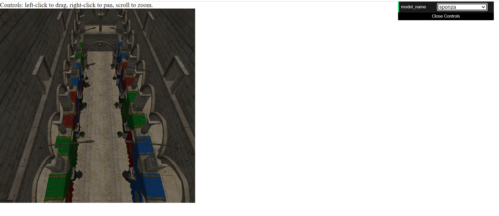

# 学习和案例
https://webgpufundamentals.org/webgpu/lessons/webgpu-fundamentals.html
https://webgpu.github.io/webgpu-samples/
https://jinleili.github.io/learn-wgpu-zh/simuverse

# 加载模型
https://carmencincotti.com/2022-06-06/load-obj-files-into-webgpu/
https://www.willusher.io/archive https://toji.dev/webgpu-gltf-case-study/

# WGSL语言介绍

- <a href="https://zhuanlan.zhihu.com/p/645215443">WGSL语言介绍</a>
- <a href="https://google.github.io/tour-of-wgsl/">tour-of-wgsl</a>
- <a href="https://www.w3.org/TR/WGSL/">w3c-wgsl</a>

# 主要封装

主要封装的工具都在 <a href="./src/tools/">tools</a> 目录下，其中核心封装有（其他库没有的）

- `tools/camera` 实现了 `PerspectiveCamera` 和 `OrbitController` 类来设置相机及其控制器，可以使用鼠标操作来控制相机视角。Controls: left-click to drag, right-click to pan, scroll to zoom.
- `tools/loaders` 实现了 `ObjLoader` 和 `GLTFLoaderV2` 分别来加载 `obj` 和 `gltf` 模型
- `tools/utils.ts` 实现了 `StaticTextureUtils` 来创建 `createDepthTexture` 和 `createMultiSampleTexture`
- `tools/math.ts` 实现一些常用的数学函数
- `tools/index.ts` 核心实现了 `checkWebGPUSupported` 和 `createCanvas` 来初始化 GPUDevice 和 canvas

使用案例见 <a href="./src/examples/14-加载gltf模型/index.ts">14-加载gltf模型</a>，我们已经做了一些必要的优化，例如缓存以减少重复创建管线和资源、更改 `render-order` 来减少管线的切换和重复的资源绑定，具体优化手段见 <a href="https://qwuzvjx4mo.feishu.cn/docx/DO7zdbtozoyp9mxyeLuc6GoDnnb">>>></a>，最终渲染流程和如下代码一致


## GLTF 模型加载用法

```typescript
import { checkWebGPUSupported, createCanvas } from "../../tools";
import { degToRad } from "../../tools/math";
import { StaticTextureUtils } from "../../tools/utils";
import { GLTFLoaderV2 } from "../../tools/loaders/GLTFLoader-v2";
import { CreateAndSetRecord } from "../../tools/loaders";
import { OrbitController, PerspectiveCamera } from "../../tools/camera";
import { ObjLoader } from "../../tools/loaders/ObjLoader";

// 配置
const config = {
  path: "/glTF-Sample-Models/2.0/Buggy/glTF-Binary/Buggy.glb",
  near: 0.01,
  far: 1000,
  eye: [100, 200, -0],
  target: [0, 0, 0],
  zoomSpeed: 30,
}


// 初始化 GPUDevice 和 canvas
const { device, format } = await checkWebGPUSupported();
const { ctx, canvas, aspect } = createCanvas(500, 500, { device, format });

const bindGroupLayouts = [];

// 创建相机
const camera = new PerspectiveCamera(
  device,
  degToRad(75),
  aspect,
  config.near,
  config.far
);
camera.lookAt(config.eye, config.target);
const orbitController = new OrbitController(camera, canvas, {
  zoomSpeed: config.zoomSpeed,
});
bindGroupLayouts.push(camera.bindGrouplayout);

// 加载 gltf 模型 或者 obj 模型
const loader = new GLTFLoaderV2();
const scene = await loader.load(device, config.path, {
  bindGroupLayouts,
  format,
  record: new CreateAndSetRecord(),
});


export async function frame() {
  const canvasTexture = ctx.getCurrentTexture();
  const depthTexture = StaticTextureUtils.createDepthTexture(device, [
    canvasTexture.width,
    canvasTexture.height,
  ]);
  const encoder = device.createCommandEncoder();
  const pass = encoder.beginRenderPass({
    colorAttachments: [
      {
        loadOp: "clear",
        storeOp: "store",
        view: canvasTexture.createView(),
      },
    ],
    depthStencilAttachment: {
      depthClearValue: 1.0,
      depthLoadOp: "clear",
      depthStoreOp: "store",
      view: depthTexture.createView(),
    },
  });
  // 渲染
  orbitController.render(pass, device);
  const record = scene.render(pass);
  pass.end();
  device.queue.submit([encoder.finish()]);
  requestAnimationFrame(frame);
  console.log(record);
}
```

## 加载效果截图

项目地址：https://yanglebupt.github.io/webgpu-learn/ 由于默认加载线上模型，请求模型并下载需要一定时间，一旦请求完成，模型放入浏览器缓存后，渲染很快的



# 后续进度

- 加入进度条
- 基于 Render Equation 和 BRDF 完善 PBR 渲染和 IBL env map (离线，Pre-filtered)
- 完善 gltf 中的骨骼动画
- 开发一个基于 WebGPU 的小引擎（其实从加载 GLTF 这个案例已经可以看到雏形了），主要功能如下
  - 立方体的几何形状，其他形状可以进行自定义
  - 支持对形状进行基本的几何变换
  - 支持基本材质，可以设置颜色和各种贴图，并且受光源影响
  - 支持单一光源
  - 支持场景节点树